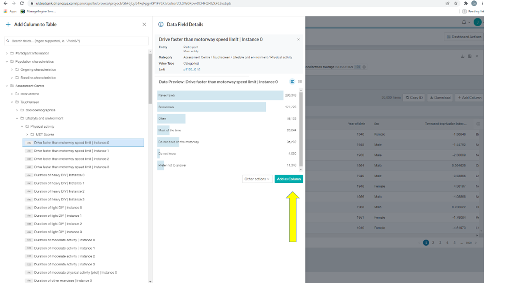
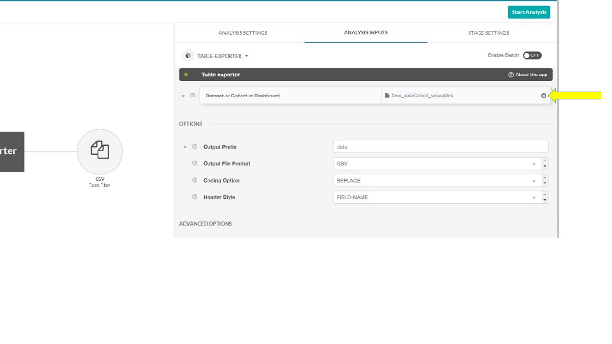

```{r, include = FALSE}
knitr::opts_chunk$set(
  collapse = TRUE,
  comment = "#>",
  fig.width = 12,
  fig.height = 8
)
```

This tutorial is on pre-processing for non-accelerometer data. Pre-processing is an important part of the project pipeline – we hope this will give you a lot of flexibility e.g. to decide what variables you want to work with. 

This tutorial contains: 

1.  Troubleshooting
2.  UK Biobank
3.  Available data
4.	Downloading covariate data
5.	Processing health outcomes data
6.	Merging data files
7.  Participant withdrawals
8.  Exclusions
9.  Preprocessing
10. Finding out more 

***


# Troubleshooting 

If something is not working, speak to [Rosemary](mailto:rosemary.walmsley@gtc.ox.ac.uk).

Often the first thing to check is that all the files can be found in the specified locations. 

***


# UK Biobank

Read all about UK Biobank on the [UK Biobank website](https://www.ukbiobank.ac.uk/). 

UK Biobank is a large prospective cohort study of just over 500,000 participants. Between 2006 and 2010, people aged 40-69 living in England, Scotland, and Wales within roughly 25 miles of an assessment centre were recruited by letter.

It has several components: 

- All participants attended a baseline assessment centre, where they answered a touchscreen questionnaire, had an interview with a trained interviewer, had several anthropometric measurements, and gave biological samples. 
- Based on samples at baseline assessment, all participants have had genotyping and exome sequencing. Whole genome sequencing is being done and has recently been released for a subset of participants.
- Passive follow-up is conducted for all participants through NHS records, principally death registry data and Hospital Episode Statistics (on inpatient episodes). Primary care data on the whole cohort is available only for COVID-related research.
- Just over 100,000 participants took part in a 7-day wrist-worn accelerometer wear between 2013 and 2015.
- Many optional online questionnaires have been conducted, on topics as diverse as diet, mental health, cognitive function, and more.
- Some participants have returned for a repeat of baseline assessment centre. Participants are currently returning for a repeat of baseline assessment along with imaging.

***


# Available data 

For this data challenge we will use accelerometer data, "standard" participant data (i.e. one-row-per-participant tabular data on covariates), Hospital Episode Statistics data, and death register data.

UK Biobank is currently in the process of moving from a model where you download a local copy of an encrypted dataset and do all processing locally to a model where you work with the data through a [Research Analysis Platform](https://www.ukbiobank.ac.uk/enable-your-research/research-analysis-platform) (RAP). On the RAP. you can prepare datasets and perform analyses. It has several advantages over local data, including centralised data security, automatic updates to data, and nicer formatting. However, it's not yet as flexible as using a local copy: for example, it's currently not possible to use RStudio on the RAP (although this is coming in 2022). 

As the RAP is quite new, we"re currently working out workflows on the new system. In this course, we will use a hybrid approach. 

We provide several files locally. These can be found under `/cdtshared/wearables/health_data_files`. Please do not change the contents of this folder.

- `base_cohort_wearables.csv`: A "starter" dataset of participant data downloaded from the Research Analysis Platform.
-	`hesin_all.csv`: Hospital Episode Statistics data. Each line is associated with an in-hospital diagnosis.
-	`death.txt`: Death register data. This has one line per entry in the death register (almost always one line per participant who died), giving their date of death.
- `death_cause.txt`: Death register data on cause of death (multi-line per participant). 
-	`accelerometer.csv`: A basic accelerometer dataset. You will hopefully have your own version of this after week 1 of the Data Challenge.
- `dataset-with-preprocessing-done.csv`: A prepared dataset, for use in the next tutorial. 

We will use the RAP to add variables not available in the prepared dataset.

Data should **never** be downloaded to your local machine: you should always be working on the VM. All data should be deleted at the end of the Data Challenge. We will email you to confirm this.

***


# Downloading covariate data

This section explains how to use the RAP to download different sets of variables. If all the covariate data needed for your analysis is available in `base_cohort_wearables.csv` you might not actually need to do this in the Data Challenge. But you can still spend some time exploring the platform.

Read more about the platform in the [user guide](https://dnanexus.gitbook.io/uk-biobank-rap/working-on-the-research-analysis-platform/ukb-rap). Here is a [Quickstart Guide](https://dnanexus.gitbook.io/uk-biobank-rap/getting-started/platform-overview). 

Using the platform does entail processing and storage costs. You have some credit to start with. If you stick to the kinds of tasks mentioned in this tutorial (processing and visualising covariate data and filtering participants), you are unlikely to run into any problems. 

## Step 1: Approval

Before you can use the Research Analysis Platform, you need to:

- Ensure that you are listed as a collaborator on a UK Biobank-approved access application.
- Create a UK Biobank Access Management System (AMS) account, via the [AMS signup page](https://bbams.ndph.ox.ac.uk/ams/signup).
- Ensure that you’ve received UK Biobank access approval from the UK Biobank Access Management Team (AMT). If you haven’t, log into the AMS and follow the directions to complete your registration and get AMT approval.

## Step 2: Creating an account

Create a RAP account (or log in if you have an account) 

- Navigate to the [RAP](https://ukbiobank.dnanexus.com/landing). Click **Create an Account**.

- Fill out the Create New Account form, then click **Create Account**. Note that in selecting a username, you don’t need to use the same username you use on the UK Biobank AMS.

- You"ll receive an email with a link to click, to activate your account. Click the link.

- Log into the Platform.

- Complete your profile, then click **Access Platform**.

## Step 3: Accessing and using UKB data through a project

- Navigate to **Projects** in the top left hand corner. 

- You will be added to Aiden’s project **wearables-nov21**. Make sure to have **Contributor** access (can be seen when clicking on **Projects** on the top left side of the website). This will allow you to access specific datasets and conduct analyses on these datasets. 

- Select this project. You should see a list of folders and datasets within the chosen project.

- The file `base_cohort_wearables_dec21` is the file available locally as `base_cohort_wearables`. This file includes the UKB wearables cohort with a set of covariates (demographics, biometrics etc.).


- In the cohort browser **Data Preview** you can see the variables included in this dataset.

- In order to add variables of interest, click on **Add column** on the right.

- Choose the variable from one of the folders that are shown on the left and click on **Add as column** (e.g. drive faster than motorway speed limit):



- **A note on instances and array indices**:  Variables in UK Biobank come with instances and array indices. For most variables with instancing, repeat 1 refers to a resurvey among a limited number of participants and repeat 2 is the imaging visit. Both apply only to a subset of participants. More importantly, some variables have multiple items, as participants could give multiple answers (e.g. employment history) or had multiple measurements taken at a single visit (e.g. blood pressure measurements).

- Additionally, filters can be applied to show only participants with certain characteristics

- To add a filter, click on **+ Add Filter** next to the cohort’s name and choose the variable as well as the value (e.g., sex, female to include only females)

- To remove the filter, either click on the small **x** visible next to the individual filter OR click on **Clear All Filters** to remove all filters (brings you back to the baseline cohort of 502,415 participants)

- To remove a column, click on the grid icon (**customize columns**) below the **Add Column** field and click on the **-** of the variable you want removed.

- Once all filters are set and all variables needed have been added as columns, you can save the cohort by clicking on the save sign in the top right hand corner:


- Choose a name and save the cohort under `CDT/CDTgroupX/`.

- Don't forget to document the datasets you prepare and keep the folders you have as clean as you can. The RAP system helps with documentation - but there's nothing more frustrating than coming back to a dataset and not knowing what's in it or why.

- The RAP system can be slow. Please be patient.

## Step 4: Exporting the cohort / dataset to `csv`

- First, you need to create a `csv` file.

- For this, navigate back to your project (**Project** on the top left, pick the correct project) and click the **Start Analysis** button in the upper right corner of the screen.

- Select **Table Exporter** from the list of apps, then click **Run Selected**. Note that if this is the first time you have run Table Exporter, you"ll be prompted to install it first!

- Within the Table Exporter app, open the **Analysis Inputs 1** tab on the right side of the screen. Then click the **Dataset or Cohort or Dashboard** tile. 



- You can export the data in different formats. UKB variables have field numbers as well as names, and categorical variables are stored as numbers to reduce the size of the dataset. To download a csv file with variable names and variable coding already done, choose the output file format as **csv**, coding option **REPLACE** and header style **FIELD NAME**. 

- Click on **Start Analysis** on the top right

- Once the conversion finishes and the file is ready, you will be notified via email. To access the file, either return to your project, or click the link in the email.

## Step 5: Download the `csv` file to the VM

- Do **not** download the file using the **Download** button, as this will download to your device 

- Instead, use the RAP command line interface

- Login to the VM and complete all steps below on the VM

- Load a pip environment:

```{r pipenv, engine = 'bash', eval = FALSE}
python3 -m venv my_new_env
source my_new_env/bin/activate
```

- Run `pip3 install dxpy` ([Downloads - DNAnexus Documentation](https://documentation.dnanexus.com/downloads)).You may find you need to update `pip`: `pip install --upgrade pip`.

- Run `dx login` to log you in to the RAP ([Command Line Quickstart - DNAnexus Documentation](https://documentation.dnanexus.com/getting-started/tutorials/cli-quickstart))

- Run `dx cd CDT/`  to navigate between directories on the RAP

- To download the file `my_new_cohort.csv`, run `dx download my_new_cohort_filename.csv` 

- Logout using `dx logout`. Your file should now be downloaded. 

***


## Do it with your own cohort

You can repeat this with your own cohort. To create one, click on the **base_cohort_wearables_light** (this cohort contains only eid and sex) and add the columns you need (see previous steps), save the new cohort, convert to csv and download the file.

Sometimes you might want to add only one or two variables that you realise are relevant. Note that the quickest way to do this is to add these variables to the bare **base_cohort_wearables_light** and then merge your downloaded csv file into the copy of the dataset you're already working with locally. 

Feel free to try out other data visualisation features of the browser (e.g. adding **Tiles** to the **Dashboard**). Stick to using "standard" covariate data only. Do not use the **Bulk** data (e.g. genetic data). It is beyond the scope of this challenge. It may also be expensive or tricky to process.


# Processing health outcomes data 

We have provided a utility script (`other_processing_scripts/addNewHES.py`) to automatically add health outcomes data to a dataset. To do so, you need to define the ICD codes of interest in a JSON file. An example is: `other_processing_scripts/icdGroups.json`. The JSON file also needs a "level" argument to be specified: "all" identifies all diagnoses, whereas "primary" identifies only diagnoses which were the primary diagnosis for that episode.

Then run:

```{r bashcmds, engine = 'bash', eval = FALSE}
python other_processing/addNewHES.py /cdtshared/wearables/health_data_files/base_cohort_wearables.csv /cdtshared/wearables/health_data_files/hesin_all.csv data/base_cohort_wearables_with_hes.csv other_processing/icdGroupsIHD.json --incident_prevalent True --date_column p90011 # This last argument means incident vs prevalent disease is defined 
# relative to the end of accelerometer wear
# Note you should replace "data/base_cohort_wearables_with_hes.csv" with where you want to save file
```

This will add a column containing the date of first instance of the given disease definition, as well as a binary column indicating incident disease and a binary column indicating prevalent disease (relative to the date in the specified date column). 

This dataset includes hospital admissions only. You will probably also want to use data on deaths, which can be found in the `death.txt` and `death_cause.txt` files. Even if mortality is not your outcome, if you are doing analyses of survival data, participants are censored at death for other outcomes. Also, sometimes a disease event may appear in the death register without appearing in Hospital Episode Statistics e.g. a fatal stroke occurring outside of hospital would be recorded on the death register but not in HES.

Censoring dates for all outcome data at time of download of these files were 2021-02-28 for the death register; 2021-03-31 for HES in England and Scotland, 2018-02-28 for HES in Wales. Read more about what these censoring dates mean [here](https://biobank.ctsu.ox.ac.uk/crystal/exinfo.cgi?src=Data_providers_and_dates).

## Defining the outcome

One of the challenges in the Data Challenge will be working out how to define your health outcome. Some things to think about: 

- Disease codes in HES data and on the death register mostly use [ICD-10 codes](https://icd.who.int/browse10/2010/en). Some records from the 1990s and earlier use its precursor, ICD-9, but this is a small proportion.
- Previous papers might be a helpful source of disease definitions. 
- If you can, it's usually useful to speak to someone with clinical expertise. 
- There are some papers looking at the features of different data sources for different health outcomes e.g. [this paper on stroke](https://n.neurology.org/content/95/6/e697). [This paper](https://www.ncbi.nlm.nih.gov/pmc/articles/PMC3264740/) discusses contexts in which different aspects of accurate classification are important.
- HES data in UK Biobank is *inpatient* episodes only. That means that it only includes hospital visits where the participant occupied a bed (not necessarily overnight). This means Emergency Department attendances and outpatient appointments which did not result in admission will not be present in the data. This is more of an issue for some conditions than others. 
- Primary care data is available on a subset of UK Biobank participants (to be expanded to all participants eventually), but is beyond the scope of this challenge. 
- Operations and procedures codes are also available but are again beyond the scope of this challenge.
- There are some quirks to the HES data. For example, psychiatric admissions are included in English and Welsh data, but not in Scottish data. 
- If you want to learn more about HES data in UK Biobank, see [this resource](biobank.ndph.ox.ac.uk/ukb/ukb/docs/HospitalEpisodeStatistics.pdf).

***


# Merging data files

You can merge data files using the "eid" column.

Note that with accelerometer data, the "eid" column may need adjusting to remove extra text. 

```{r accdat}
# First we"ll load data.table, a package that makes reading large files easier
if (!require("data.table")) install.packages("data.table")

# Then we load acc data and covariate data
df_acc <- data.table::fread("../data_and_data_prep/accelerometer.csv", data.table = FALSE) # replace file location with /cdtshared/wearables/health_data_files/accelerometer.csv
df_cov <- data.table::fread("../data_and_data_prep/base_cohort_wearables_with_hes.csv", data.table = FALSE) # replace file location with location in which you saved the cohort with added HES data

# Then we relabel eids to same format
df_acc$eid <- sub("_90001_0_0.gz", "", df_acc$eid) # This line replaces the first string with the second one wherever it appears in acc$eid

# Then we merge
df <- merge(df_cov, df_acc, by = "eid")

# And clean up the environment
rm(df_acc, df_cov)
```

Note that the "eid" column is different for every UK Biobank project. Therefore, you can use it to merge files within the same project, but not to merge files between projects.

***


# Withdrawals 

It is useful to know that participants have the right to withdraw at any time from UK Biobank. One of the advantages of using the RAP system is that participants are withdrawn automatically from datasets on the RAP. We have manually withdrawn participants from the other datasets we have provided in the CDT, so you do not need to perform withdrawals in this particular project.

***


# Exclusions 

Before working with the data, we usually exclude some participants.

It's a good idea to record how many participants are excluded at each of the above steps. Usually, studies present a [flow diagram](https://journals.plos.org/plosmedicine/article?id=10.1371/journal.pmed.0040297) (see point 13c) to be precise about which groups of participants were left out and why:

```{r}
tab_exc <- data.frame("reason" = "Starting cohort", "n_exc" = NA, "n_after" = nrow(df))
```

First, we exclude participants with poor quality accelerometer data. A standard protocol for exclusions in UK Biobank is to: 

- Exclude participants whose device could not be calibrated: 

```{r exc1}
nb <- nrow(df)
df <- df[df$quality.goodCalibration ==1, ]
tab_exc <- rbind(tab_exc, data.frame("reason" = "Poor calibration", "n_exc" = nb - nrow(df), "n_after" = nrow(df)))
```

- Exclude participants who had <3 days wear or did not have wear in each hour of the 24 hour day: 

```{r exc2}
nb <- nrow(df)
df <- df[df$quality.goodWearTime == 1, ]
tab_exc <- rbind(tab_exc, data.frame("reason" = "Poor wear time", "n_exc" = nb - nrow(df), "n_after" = nrow(df)))
```

- Exclude participants for whom >1% of values were clipped (fell outside the sensor's range) before or after calibration: 

```{r exc3}
nb <- nrow(df)
df <- df[(df$clipsBeforeCalibration < 0.01*df$totalReads) & (df$clipsAfterCalibration <0.01*df$totalReads) , ]
tab_exc <- rbind(tab_exc, data.frame("reason" = "Too many clips", "n_exc" = nb - nrow(df), "n_after" = nrow(df)))
```

- Exclude participants with unrealistically high average acceleration values: 

```{r exc4}
nb <- nrow(df)
df <- df[df$acc.overall.avg < 100, ]
tab_exc <- rbind(tab_exc, data.frame("reason" = "Very high average acc", "n_exc" = nb - nrow(df), "n_after" = nrow(df)))
```

If you're interested in finding out more [this is a good reference](https://journals.plos.org/plosone/article?id=10.1371/journal.pone.0169649). There is a lot of literature on accelerometer data quality! 

There are two other types of exclusions you may wish to make, depending on your planned analysis. These can be done now, or later when you're recoding and processing variables:

- Health-related exclusions. For example, if you are analysing incident disease, you may wish to exclude people who had prevalent disease at the time they wore the accelerometer.
- Missing covariate data. If small numbers of participants have missing data in covariates, you may wish to exclude them. (Alternatively, you could look into missing data imputation). 

 
```{r excmissing}
# Exclude participants with prevalent IHD in hospital data
# You might want to also exclude prevalent self-reported IHD
nb <- nrow(df)
df <- df[df$`ischaemic-heart-disease-prevalent` == 0, ]
tab_exc <- rbind(tab_exc, data.frame("reason" = "Prevalent ischaemic heart disease in HES", "n_exc" = nb - nrow(df), "n_after" = nrow(df)))

# Exclude participants missing smoking status 
nb <- nrow(df)
table(df$p20116_i0)
df <- df[(df$p20116_i0 %in% c("Previous", "Never", "Current")), ]
tab_exc <- rbind(tab_exc, data.frame("reason" = "Missing/unanswered smoking status", "n_exc" = nb - nrow(df), "n_after" = nrow(df)))

# Exclude participants missing BMI
nb <- nrow(df)
df <- df[(!is.na(df$p21001_i0)), ]
tab_exc <- rbind(tab_exc, data.frame("reason" = "Missing BMI", "n_exc" = nb - nrow(df), "n_after" = nrow(df)))
```

How many participants excluded:

```{r allexc}
tab_exc
```

**Watch out for NA values** Lots of the R code in these tutorials [will do some very weird things if you have `NA` values in variables](https://www.r-bloggers.com/2018/10/subsetting-in-the-presence-of-nas/). Have a look and check it's behaving as you expect. 

***


# Preprocessing 

The downloaded data has fields named using UK Biobank field IDs. You can identify these using the [Data Showcase](https://biobank.ndph.ox.ac.uk/showcase/search.cgi), and relabel as appropriate. See note above on the meaning of the second 2 numbers in the filename: the instance, and the array index. Note for some variables you need all array indices.

```{r basicrecoding}
df$sex <- df$p31
df$month_birth <- df$p52
df$year_birth <- df$p34
df$ukb_assess_cent <- df$p54_i0
df$smoking <- df$p20116_i0
df$BMI <- df$p21001_i0
df$end_accel_wear <- as.Date(df$p90011, format = "%Y-%m-%d")
df$date_ihd <- as.Date(df$`ischaemic-heart-disease`, format = "%Y-%m-%d") # format date variable.
```


Have a look at the variables you're planning to use in more detail, understand their distribution, recode any values you wish to recode, and change groupings as required. For example, the [ethnicity variable](https://biobank.ndph.ox.ac.uk/showcase/field.cgi?id=21000) has many distinctions, some of which apply to very few participants, so you may wish to recode it for statistical analyses. Spending time understanding the data in detail now will not be wasted! The [UKB Data Showcase](https://biobank.ndph.ox.ac.uk/showcase/search.cgi) is the go-to resource for understanding variables in the data.

One thing you will need to do is add an age-at-accelerometer-wear variable. Here's an example of some code to do that:

```{r age}
# Add date of birth
df$approx_dob <-
  as.Date(paste(df$year_birth, df$month_birth, "15", sep = "-"),
          "%Y-%B-%d") # UK Biobank doesn't contain day of birth as it would be unnecessary identifying information, so we impute it as the 15th of the birth month.

# Add age at entry in days
df$age_entry_days <-
  difftime(df$end_accel_wear,
           df$approx_dob,
           units = "days")

# Convert to age at entry in years
df$age_entry_years <- as.double(df$age_entry_days) / 365.25

# Add age groups
df$age_gp <-
  cut(
    df$age_entry_years,
    breaks = c(40, 50, 60, 70, 80),
    right = FALSE,
    labels = c("40-49", "50-59", "60-69", "70-79")
  )

```

If you're interested in incident disease analyses, you might also need to add a follow-up time variable i.e. the difference between the time the participant entered the study (accelerometer wear date) and when they left it: death, censoring (end date of study data, at which point they had not had an event) or the event of interest. First we need to set up the data in an appropriate format, with a follow-up time and an indicator at exit indicating whether the participant exited due to an event or due to being censored (either the participant died of another cause or study data ended before they had an event). As noted above, censoring at time of download of these files were 2021-02-28 for the death register; 2021-03-31 for HES in England and Scotland, 2018-02-28 for HES in Wales. We'll look at incident ischaemic heart disease (IHD):

```{r dates}
# Load data on participants who died
df_death <-
  read.csv("../data_and_data_prep/death.txt", sep = "\t")# Replace file location with "/cdtshared/wearables/health_data_files/death.txt"
df_death_cause <-
  read.csv("../data_and_data_prep/death_cause.txt", sep = "\t")# Replace file location with "/cdtshared/wearables/health_data_files/death.txt"
df_death <-
  df_death[df_death$ins_index == 0, ]  # Keep just one record per participant: a very small number of participants have duplicate records

# Format date data
df_death$date_death <-
  as.Date(df_death$date_of_death, format = "%d/%m/%Y")

# Add a death indicator
df$died <- ifelse(df$eid %in% df_death$eid, 1L, 0L)

df <-
  merge(
    df,
    df_death[, c("eid", "date_death")],
    by = "eid",
    all.x = TRUE,
    suffixes = c("", "dup")
  )
cat(sum(df$died), "participants died.\n")

# Record country-wise censoring dates (see note above)
indic_wales <-
  df$ukb_assess_cent %in% c("Cardiff", "Wrexham", "Swansea")
df$date_cens <- as.Date(ifelse(indic_wales,  "2018-02-28", "2021-02-28"))

# People who died are censored at earliest of date of death and overall censoring
# e.g. a participant in Wales who died in 2020 should be censored at 28.02.2018
died <- df$died == 1
df$date_cens[died] <-
  pmin(df$date_cens[died], df$date_death[died])

# Add follow up variable
# i.e. censor date for participants without an event, event date for participants with event in study period
df$date_fu <- df$date_cens
had_ihd <-
  df$`ischaemic-heart-disease-incident` == 1 # make indicator variable
df$date_fu[had_ihd] <-
  pmin(df$date_ihd[had_ihd], df$date_fu[had_ihd])

# Record event status at exit
# Why aren't we just using the ischaemic.heart.disease.incident variable? There are instances of entries in the data after censoring.
had_ihd_in_study_period <- had_ihd & (df$date_ihd == df$date_fu)
df$inc_ihd <- ifelse(had_ihd_in_study_period, 1L, 0L)
cat(
  sum(df$inc_ihd),
  "had incident hospital diagnosed ischaemic heart disease within the follow up period"
)

# Mark inc_ihd for participants with no HES-record of IHD but a record of IHD at death
died_no_hes_ihd <- died & !(had_ihd)
ids_with_death_ihd <-
  df_death_cause$eid[grepl("I20|I21|I22|I23|I24|I25", df_death_cause$cause_icd10)]
death_ihd <-  df$eid %in% ids_with_death_ihd
df$inc_ihd[died_no_hes_ihd &
                 death_ihd &
                 (df$date_fu == df$date_death)] <- 1L

# Calculate follow up time
df$fu_time <-
  as.double(difftime(df$date_fu, df$end_accel_wear, units = "days"))

# Clean up our working environment 
rm(indic_wales, died, had_ihd, had_ihd_in_study_period, died_no_hes_ihd, death_ihd)
```

When working with date data, especially when dates are only present for some participants, it is very easy to write code which behaves in strange ways... I did so several times when writing this example (and don't guarantee it's error-free now). It is well worth inspecting your data repeatedly to check that the code is doing what you expect. This isn't shown here, as we can't print data on the internet, but here are some checks we can do: 

```{r checks}
df$fu_years <- df$fu_time/365.25

# Follow up time distribution
hist(df$fu_years)

# Follow up time in different groups
aggregate(df$fu_years, list(df$ukb_assess_cent), FUN=median) 
aggregate(df$fu_years, list(df$died), FUN=median)
aggregate(df$fu_years, list(df$inc_ihd), FUN=median)

```


We'll also inspect variables we want to use, to check if there's any *a priori* recoding we want to do: 

```{r smoking}
summary(df$smoking)
table(df$smoking)

summary(df$BMI)
```

We might want to take some time now to tidy up the data. We've got data from multiple sources, processed in multiple ways. So we can end up with quite a messy dataset. We can take some time to tidy it and then write it out:

```{r writedat}
hour_of_day_cols <- colnames(df)[grepl("hourOfDay", colnames(df))] # we"ll use these in next tutorial
df_final <- df[, c("age_entry_days", "age_entry_years", "age_gp", "sex", "smoking", "BMI", "inc_ihd", "date_fu", "fu_time", "end_accel_wear", "acc.overall.avg", "MVPA.overall.avg", "light.overall.avg", "sedentary.overall.avg", "sleep.overall.avg", hour_of_day_cols)]
data.table::fwrite(df_final, "../data_and_data_prep/dataset-with-preprocessing-done.csv") # replace with location in which to save file
```


**These preparatory steps are indicative of the kind of thing you might want to look at. They are not exhaustive. Think through the steps you need for the analysis you want to do e.g. adding more covariates.** 

***


# Finding out more

To find out more about particular UK Biobank variables, use the [Data Showcase](https://biobank.ndph.ox.ac.uk/ukb/)

To find out more about UK Biobank data collection and history, [this](https://journals.plos.org/plosmedicine/article?id=10.1371/journal.pmed.1001779) is a good summary

Read more about the move to the Research Analysis Platform [here](https://www.ukbiobank.ac.uk/learn-more-about-uk-biobank/news/uk-biobank-launches-innovative-cloud-based-research-analysis-platform-to-vastly-increase-scale-and-accessibility-of-the-world-s-most-comprehensive-biomedical-database)
